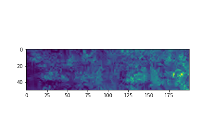

# Speckle correlation using Deep Learning algorithms on Newtonian fluids

This is a graduate thesis research of Sans (me) advised by Dr. Eric Landahl at DePaul University, Department of Physics. We are developing and deploying a novel technique braching off from the traditional Dynamic Light Scattering or DLS technique. A Newtonian fluid has a predictable viscocity such as water, which is used in this experiment with various samples, some inorganic some parasitic and biological (inactive). 

Our research overlaps classical mechanics for the experimental engineerinng and a Deep Learning algorithm to model and classify the identity of the species present in a Newtonian fluid sample. We are able to do this using a laser beam, a fixed fluid target, a double-pulse system and a detector without any lag. Such novel method gives us richer angular data and in-depth understanding of the sample via high resolution data that could be broken in pixelated form, a categorical data. Read the summary for more information about the experiment. 

Below is a partial picture of speckle produced with a sample with 490 nm latex cubes in suspension acting agent as an impurity. The image is a half of full image because of reductionality of datasize and symmetry of the image fulfills the overall input. The image is 1080 * 1920 pixels. 

 

 

 

 

